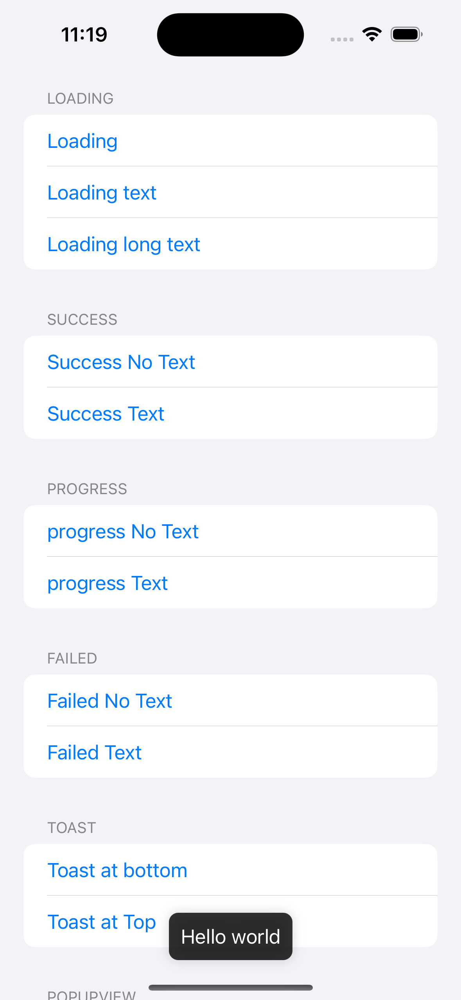
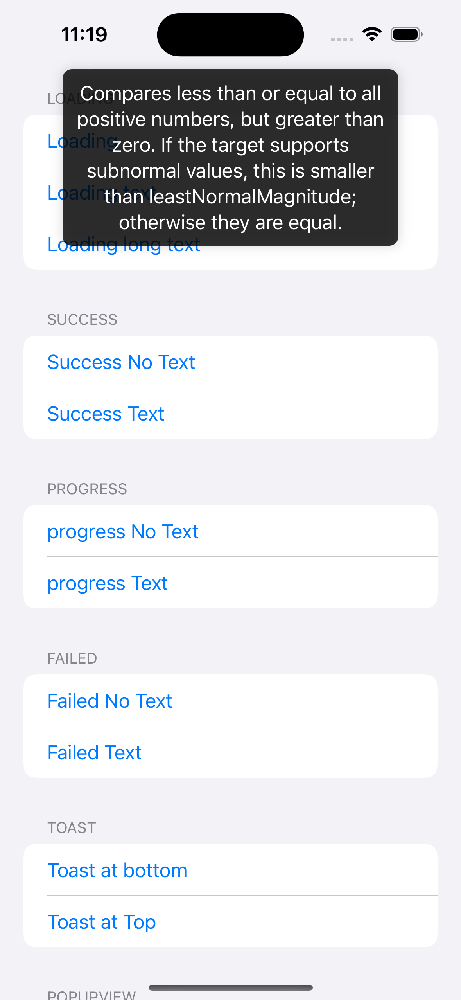

# Toast_SwiftUI

[](https://swift.org/package-manager/)


|  |  |
| -------------------- | --------------------- |

## [中文说明](https://github.com/jackiehu/Toast_SwiftUI/blob /main/README_ZH.md)

## Example

Toast_SwiftUI has a built-in plain text toast, which can be used only by toast.showText

```swift
toast.showText("Toast at bottom")

```

You can also customize your own Toast style, no intrusion, no inheritance, completely native, just need to expand the method of the controller, [see CustomView for details](https://github.com/jackiehu/Toast_SwiftUI/blob /main/Example/Toast_SwiftUI/CustomView.swift)

```swift
extension ToastManager {
    //展示自定义View//自己可以重写替换
   func showCustom(){
        show {
            CustomView()
        }
    }
}
```


## Usage

Create a controller on the page that needs to pop up Toast

```swift
    @EnvironmentObject private var toast: ToastManager
    //OR
    @StateObject var toast = ToastManager()
```

Add a controller to the page

```swift
.addToast(toast)
```

Control the position where Toast pops up, and then call the show method

```swift
toast.position = .bottom
```

```
toast.showText("Toast at bottom")
```

controller

```swift
    ///Toast停留时长
    public var duration: TimeInterval = 3
    ///Toast显示位置
    public var position: ToastPosition = .bottom
    ///Toast距离屏幕边缘
    public var padding: CGFloat = 10
```


## Install

### cocoapods

1. Add `pod 'Toast_SwiftUI'` in Podfile

2. Execute `pod install or pod update`

3. Import `import Toast_SwiftUI`

### Swift Package Manager

Starting from Xcode 11, the Swift Package Manager is integrated, which is very convenient to use. Toast_SwiftUI also supports integration via Swift Package Manager.

Select `File > Swift Packages > Add Pacakage Dependency` in Xcode's menu bar, and enter in the search bar

`https://github.com/jackiehu/Toast_SwiftUI`, you can complete the integration

### Manual Install

Toast_SwiftUI also supports manual Install, just drag the Toast_SwiftUI folder in the Sources folder into the project that needs to be installed


## Author

jackiehu, 814030966@qq.com

## More brick tools to speed up APP development

[](https://github.com/jackiehu/SwiftMediator)

[](https://github.com/jackiehu/SwiftBrick)

[](https://github.com/jackiehu/SwiftLog)

[](https://github.com/jackiehu/SwiftMesh)

[](https://github.com/jackiehu/SwiftNotification)


license

Toast_SwiftUI is available under the MIT license. See the LICENSE file for more info.
